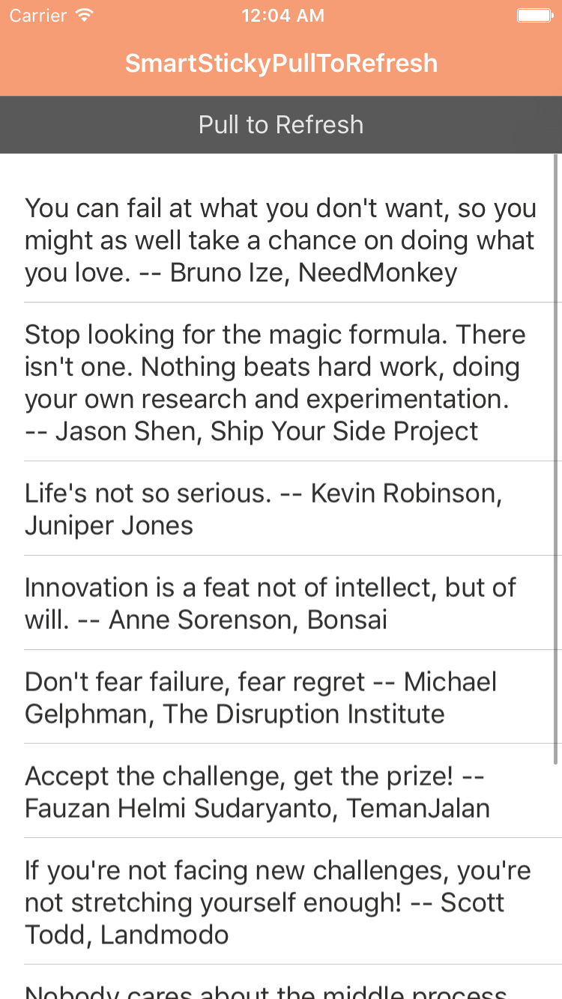
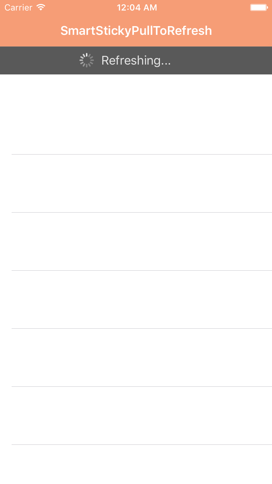

# SmartStickyPullToRefresh

[](http://cocoapods.org/pods/SmartStickyPullToRefresh)
[](http://cocoapods.org/pods/SmartStickyPullToRefresh)
[](http://cocoapods.org/pods/SmartStickyPullToRefresh)

Smart, sticky pull to refresh control for any UIScrollView. Instead of relying on the header view of a table or collection view, SmartStickyPullToRefresh uses a custom banner view that drops down from a user-selected `parentView` after a `parentScrollView` surpasses `stickyScrollViewActivationOffset` (use `stickyScrollViewPreActivationOffset` for pre-activation instructions and `stickyScrollViewDeactivationOffset` to hide these instructions).




## Usage

	SmartStickyPullToRefresh *control = [[SmartStickyPullToRefresh alloc] init];

    control.stickyParentView = self.navigationController.navigationBar; // attaches to bottom using same superview (animates INTO autolayout!)

	control.stickyScrollView = self.tableView; // any UIScrollView with contentOffset for KVO -- use custom deactivate, preactivate, activate offsets

    control.stickySmartDelegate = self; // a bunch of optional methods and required VALUE CHANGED

	[control beginDetectingPullToRefresh]; // throw into viewWillAppear -- adds KVO as-needed to stickyScrollView to animate SmartStickyPullToRefresh (a UIView) beneath and anchored below stickyParentView
	
	[control stopDetectingPullToRefresh]; // throw into viewWillDisappear -- removes KVO and any existing pull to refresh business
	
It is highly recommended to manually adjust the activation offsets, such as in the below snippet from [Submarine](http://insanj.com/submarine):

	refreshControl.stickyScrollViewDeactivationOffset = -CGRectGetMaxY(self.navigationController.navigationBar.frame) + (self.shyNavBarManager.extensionView ? -44.0 : 0);
    refreshControl.stickyScrollViewPreActivationOffset = _smartPullToRefresh.stickyScrollViewDeactivationOffset - 50.0;
    refreshControl.stickyScrollViewActivationOffset = _smartPullToRefresh.stickyScrollViewPreActivationOffset - 50.0;


To run the example project, clone the repo, and run `pod install` from the Example directory first.

## Installation

SmartStickyPullToRefresh is available through [CocoaPods](http://cocoapods.org). To install
it, simply add the following line to your Podfile:

```
pod "SmartStickyPullToRefresh"
```

## Author

insanj, insanjmail@gmail.com

## License

SmartStickyPullToRefresh is available under the MIT license. See the LICENSE file for more info.
